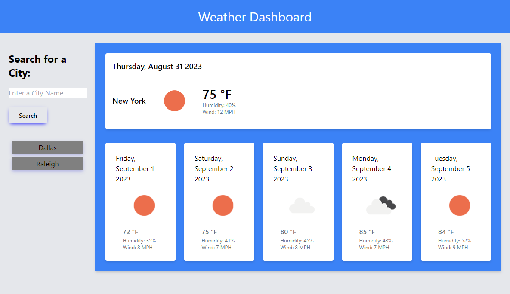

# Weather Dashboard

It is important for travelers to view the forecasted weather for their destinations, so they can plan their trip accordingly. This web application allows users to search for a city and view the city's current and future weather conditions, including the sky status (i.e. light rain, sunny, partly cloudy), temperature, humidity, and wind speed. The user is presented with the current day's weather along with a 5-day prediction. 

This application features the use of third-party APIs such as Tailwind CSS, Day.js, and jQuery, as well as server-side APIs such as Geocoding and OpenWeather.

## Usage

The application can be accessed [here](https://colcob98.github.io/weather-dashboard/).

A preview can be seen below.

## Contributions

The OpenWeather API for 5-day forecast was accessed [here](https://openweathermap.org/forecast5).

The Geocoding API for retrieving city coordinates was accessed [here](https://openweathermap.org/api/geocoding-api).